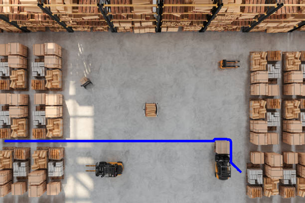
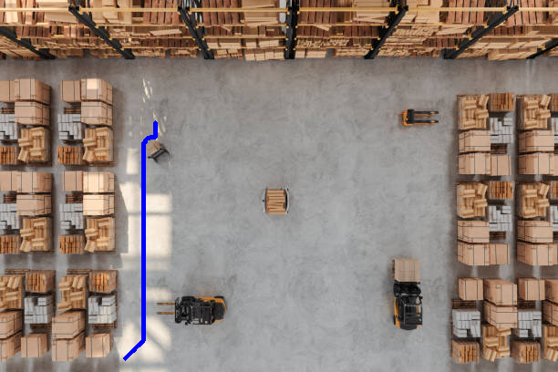
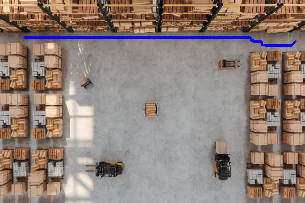
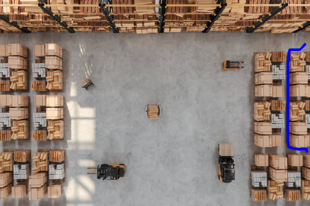

## A* Algorithm

In MRover, we use A* to autonomously travel. I have never used the algorithm myself, so I thought why not learn it? To make it robotics inspired, I have some overhead images of warehouse obstacles the robot has to travel between. Given a start position and goal position, A* is used to find the optimal path and is shown in the resulting images.

While it finds the shortest path, you can see it isn't perfect. Ideally, it would take as few turns as possible and center itself between aisles. But, I learned a lot doing this and can't wait to study this more in depth!

